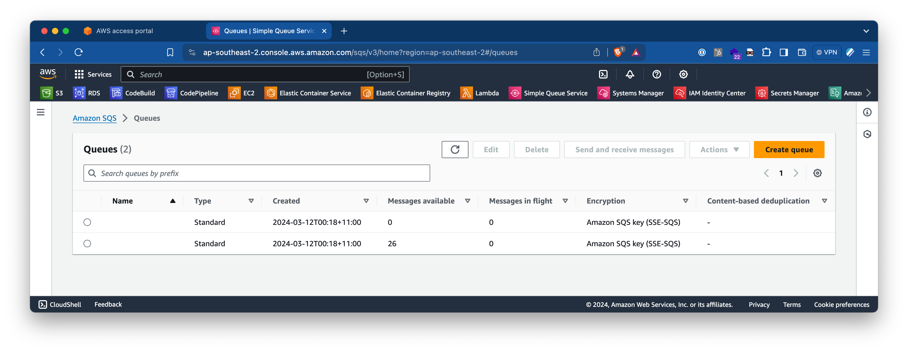
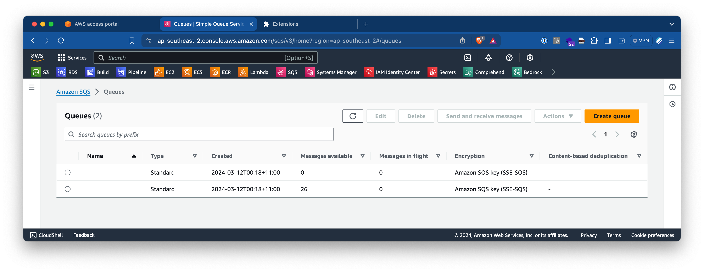

# AWS Bookmark Normaliser

## Overview

AWS Bookmark Normaliser is a browser extension designed to streamline your AWS console experience by shortening the names of AWS services in your bookmarks. Instead of seeing long names like "Amazon Transcribe" or "Simple Queue Service", you will see their shorter, more recognizable forms like "Transcribe" and "SQS". This helps in reducing the clutter and making better use of the screen real estate.

## Before and After

### Before



### After



## Why It Exists

The AWS console can get quite cluttered, especially if you have a lot of bookmarks for different services. Long service names can take up a significant amount of space, making it harder to quickly find what you're looking for. AWS Bookmark Normaliser addresses this issue by renaming these bookmarks to their standard acronyms or shorter names, making your console cleaner and more efficient to navigate.

## Features

- Automatically shortens AWS service names in your bookmarks.
- Supports a wide range of AWS services.
- Simple and lightweight, with no additional configuration required.

## Installation

1. Clone the repository:

   ```sh
   git clone https://github.com/danielferguson/aws-bookmark-normaliser.git
   ```

2. Load the extension in your browser:
   - Open Chrome and navigate to `chrome://extensions/`
   - Enable "Developer mode" in the top right corner.
   - Click "Load unpacked" and select the project directory.

## Usage

Once installed, the extension will automatically start working. Navigate to your AWS console, and you will see the bookmark names shortened to their more concise forms.

## Contributing

We welcome contributions! Please fork the repository and submit a pull request for any enhancements or bug fixes.

## License

This project is licensed under the MIT License. See the LICENSE file for more details.

## Contact

For any questions or suggestions, feel free to open an issue or contact the author at gday@danferg.com.
